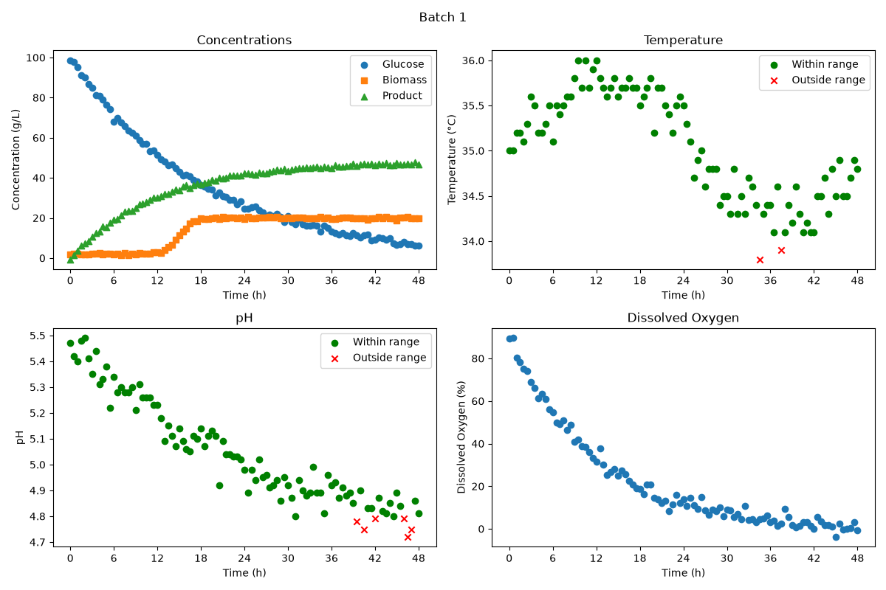

# Fermentation Process Monitor

A Python tool for analyzing fermentation batches, monitoring operating conditions, and generating process dashboards and summary tables.

## Overview

This project analyzes time-series fermentation data from multiple batches. It monitors pH and temperature against specified operating limits, visualizes process measurements, and summarizes batch performance.

The program evaluates two operating modes with different acceptable pH and temperature ranges and automatically generates dashboards and summary tables for each mode.

## Features

- Loads fermentation data from a CSV file using Pandas
- Extracts individual fermentation batches
- Identifies pH measurements inside and outside acceptable limits
- Identifies temperature measurements inside and outside acceptable limits
- Generates a 2 × 2 dashboard for each batch
- Tracks glucose, biomass, and product concentrations
- Tracks temperature, pH, and dissolved oxygen over time
- Calculates the percentage of measurements within acceptable operating ranges
- Reports final product concentration for each batch
- Exports results as PNG figures and CSV tables

## Technologies Used

- Python 3.14.7
- Pandas: 3.0.5
- NumPy: 2.5.2
- Matplotlib: 3.11.0

## Code Design

The project uses a `BioprocessMonitor` class contained in `src/classes.py`.

When `main.py` is executed, the program:

1. Loads the fermentation dataset.
2. Creates a `BioprocessMonitor` for each operating mode.
3. Processes each fermentation batch individually.
4. Determines whether pH and temperature measurements are within the specified operating ranges.
5. Generates and saves a dashboard for every batch.
6. Generates a summary table for each operating mode.

The program evaluates two operating modes with different acceptable pH and temperature limits. The same fermentation dataset can therefore be assessed using different operating specifications.

## Dashboard

The dashboard contains four plots:

- Glucose, biomass, and product concentration versus time
- Temperature versus time
- pH versus time
- Dissolved oxygen versus time

For the temperature and pH plots, green circles represent measurements within the acceptable operating range, while red X markers represent measurements outside the range.

Example dashboard for Batch 1 under Mode A:



## Summary Table

The program calculates the percentage of pH and temperature measurements within their acceptable ranges and reports the final product concentration for each fermentation batch.

Example results for Mode A:

| Batch | pH Optimal (%) | Temperature Optimal (%) | Final Product Concentration (g/L) |
|------:|---------------:|------------------------:|----------------------------------:|
| 1 | 93.81 | 97.94 | 46.5 |
| 2 | 96.69 | 97.52 | 50.8 |
| 3 | 95.89 | 93.15 | 44.6 |
| 4 | 100.00 | 96.47 | 48.6 |
| 5 | 48.62 | 99.08 | 24.7 |

The complete generated summary tables are available in the `tables` directory.

## Project Structure

```text
chg4360c-demo/
├── datasets/
│   └── dataset_fermentation.csv
├── figures/
│   ├── Batch_001_Mode_A.png
│   └── ...
├── src/
│   └── classes.py
├── tables/
│   ├── Summary_Mode_A.csv
│   └── Summary_Mode_B.csv
├── environment.yaml
├── main.py
└── README.md